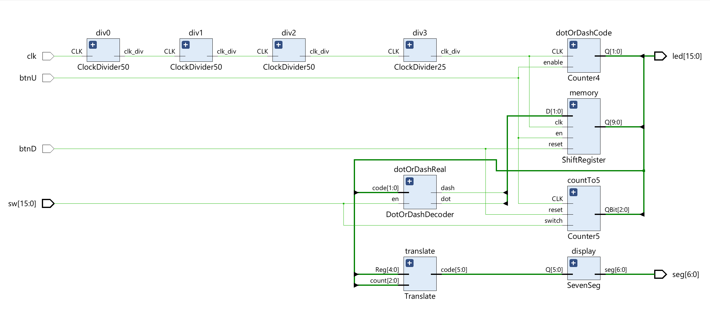

# FPGA Morse Code Signal Processor

## 📌 Project Overview
This project is a digital logic system implemented on the **Basys 3 FPGA (Artix-7)** that performs real-time Morse code decoding. 

Designed using **Structural Verilog**, the system utilizes a hierarchical modular architecture to capture asynchronous user inputs (dots/dashes), process them through a shift-register memory, and decode them into alphanumeric characters on a 7-segment display. It features a custom "Siekoo" font to ensure confusion-free character visualization.

## ⚙️ Logic Architecture
The design relies on a modular data flow rather than a single monolithic block.

### **Key Modules:**
* **`DotOrDashDecoder`:** Distinguishes between short presses (<200ms) and long holds (>200ms) using a 4-bit counter for signal duration analysis.
* **`ShiftRegister`:** A 10-bit serial-in/parallel-out register that stores the incoming sequence of dots (00) and dashes (01).
* **`Translate`:** A combinational logic tree that maps the 10-bit shift register state to a unique 6-bit character code.
* **`SevenSeg`:** Custom display driver utilizing the 'Siekoo' alphabet to render 0-9 and A-Z legibly on the hardware.
* **`ClockDivider`:** Cascaded frequency dividers to step down the 100MHz system clock for human-scale timing.

## 🚀 Key Features
* **Visual Input Verification:** Uses `led[4:3]` to provide real-time feedback on signal registration (Dot vs. Dash) before the user releases the button.
* **Deep Memory:** Capable of storing and decoding sequences up to 5 inputs long.
* **Safety Reset:** Implements a **Hold-to-Clear** mechanism on `BtnD` to prevent accidental memory flushing.
* **Visual Debugging:** Maps internal states (Counter value, Shift Register content) to the on-board LED array for real-time logic verification.

## 🛠 Hardware Stack
* **Board:** Digilent Basys 3
* **FPGA:** Xilinx Artix-7 (XC7A35T)
* **Language:** Verilog (Structural/Modular)
* **Toolchain:** Xilinx Vivado

## 📖 Usage
1. **Enable:** Flip `sw[0]` HIGH to arm the system.
2. **Input:** Press `BtnU` and watch `led[4:3]` for feedback:
    * **Dot:** Release when `led[3]` illuminates (Short press).
    * **Dash:** Release when `led[4]` illuminates (Long press).
3. **Reset:** Press `BtnD` to clear the shift register and counter.
4. **Output:** The 7-segment display will update in real-time as the sequence is built.
